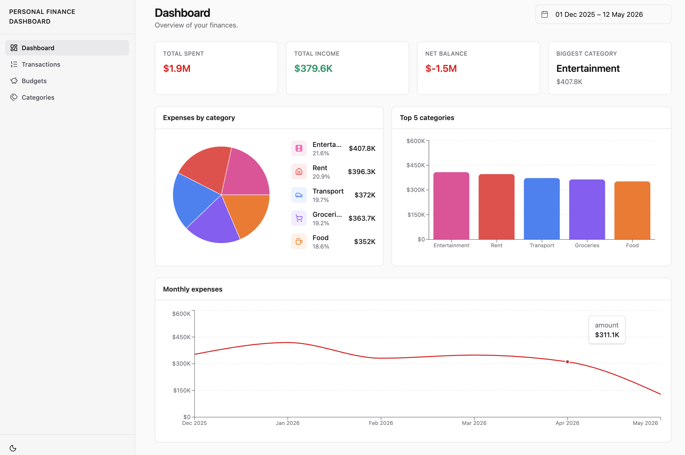

# Finance Flow

A modern personal finance dashboard built with React, TypeScript, and AI-assisted development.

## Live Demo

https://personal-finance-flow.vercel.app/

## Preview



## Features

- Financial overview dashboard with charts and summary cards
- Transaction's management with filtering, search, and URL-persisted state
- Budget tracking with progress indicators
- Categories management
- Responsive mobile/tablet/desktop layouts
- Dark mode support
- Mock API with realistic async behavior using MSW
- Form validation for transaction, budget, and category forms

## Tech Stack

### Frontend

- React 19
- TypeScript
- Vite
- Tailwind CSS
- shadcn/ui
- React Router

### Data & State

- TanStack Query
- URL search params
- MSW

### Forms & Validation

- react-hook-form
- Zod

### Charts & UI

- Recharts
- Lucide React

### Tooling

- ESLint
- Prettier

### AI Tooling

- Claude Code

## Architecture

The project uses a feature-oriented structure.

Shared UI primitives and layout components live in `src/components`, while domain-specific code is grouped by feature:

- `features/transactions`
- `features/budgets`
- `features/categories`
- `features/dashboard`

State is split by responsibility:

- **Server state** — handled with TanStack Query
- **URL state** — used for transaction filters and search state
- **Local UI state** — used for dialogs, forms, mobile navigation, and theme UI

The project intentionally avoids unnecessary global state. A `store` directory exists, but no global store is used until there is a real need for one.

MSW is used to simulate realistic API behavior without adding backend infrastructure complexity.

## Responsive UX

The app includes responsive layouts for mobile, tablet, and desktop:

- mobile navigation with a sheet menu
- adaptive page headers
- mobile-friendly transaction filters
- responsive dashboard cards and charts
- table/card presentation for dense data views
- dark mode support across pages and shared components

## AI-Assisted Development

Claude Code was used throughout development for implementation, debugging, refactoring, and responsive UX polish.

The AI workflow is intentionally documented as part of the project because the goal is not only to build a dashboard, but also to demonstrate practical AI-assisted frontend development.

## Project Structure

```txt
src/
├── api/
│   ├── mockData.ts
│   ├── msw/
│   │   ├── browser.ts
│   │   └── handlers.ts
│   └── queryKeys.ts
├── assets/
├── components/
│   ├── layout/
│   └── ui/
├── features/
│   ├── budgets/
│   ├── categories/
│   ├── dashboard/
│   └── transactions/
├── hooks/
├── lib/
├── pages/
├── router.tsx
├── types/
├── App.tsx
└── main.tsx
```

## Local Development

Install dependencies:

```bash
npm install
```

Start the development server:

```bash
npm run dev
```

Run linting:

```bash
npm run lint
```

Format code:

```bash
npm run format
```

Check formatting:

```bash
npm run format:check
```

## Production Build

Create a production build:

```bash
npm run build
```

Preview the production build locally:

```bash
npm run preview
```

## Status

This project is currently in MVP polish phase.

Planned next steps:

- add baseline performance measurements
- optimize bundle size and render performance
- add Lighthouse CI
- add selected unit and E2E tests
- document before/after performance metrics

## License

MIT
