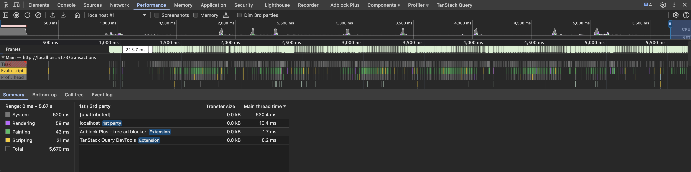
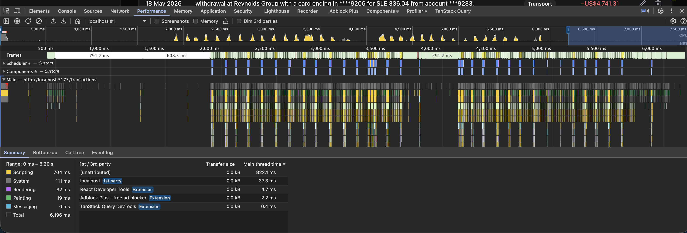

# Performance comparison

Optimization work is captured incrementally, with baselines stored in `performance-before/` and post-change results in `performance-after/`.

The goal of this project was not only to improve Lighthouse scores but to identify, measure, and reduce real bottlenecks in bundle loading, rendering, runtime behavior, and data fetching.

---

# Day 9 — Bundle + runtime optimization

## Goal

Reduce initial JS payload, move heavy code off the synchronous boot path, and remove mock/runtime overhead from production builds.

---

## Headline results

| Metric                                          | Before    | After     | Δ             |
| ------------------------------------------------| ----------| ----------| ------------- |
| Sync-parsed entry JS (gz)                       | 336.25 KB | 41.29 KB  | **−87.7%**    |
| First-visit `/dashboard` JS (gz)                | 579.67 KB | 497.57 KB | −14.2%        |
| First-visit `/budgets` or `/categories` JS (gz) | 579.67 KB | ~199.7 KB | **−65.5%**    |
| Demo MSW chunk (gz)                             | 243.42 KB | 88.46 KB  | **−63.7%**    |
| Production MSW chunk                            | present   | removed   | eliminated    |
| Faker in runtime bundle                         | yes       | no        | eliminated    |
| Modules transformed                             | 3860      | 3544      | −316          |

---

## Key outcome

Production builds removed:

- MSW
- faker
- runtime fixture generation
- unnecessary synchronous route code

Critical JS path reduced from:

```txt
~580 KB gz
↓
~41 KB gz
```

for production builds.

---

## Changes shipped

### Bundle optimization

- Added `React.lazy` for routes
- Added `Suspense` boundaries
- Lazy-loaded dashboard charts
- Split chart code from dashboard page code
- Added minimal `manualChunks`
- Moved runtime `navItems` out of shared types

### Runtime optimization

Added separate build targets:

```txt
npm run build
npm run build:demo
```

Introduced:

- `VITE_ENABLE_MSW`
- conditional MSW bootstrap
- build-time fixture generation
- pre-generated JSON mocks

Removed:

- unconditional worker startup
- runtime faker generation
- `mockData.ts`

---

## Verification

Confirmed:

✓ `npm run build` excludes MSW entirely  
✓ `npm run build:demo` keeps mocks functional  
✓ `npm run preview` works  
✓ Vercel demo remains functional  
✓ No runtime faker imports remain  
✓ No static MSW imports remain in app bootstrap

---

## Outcome

Bundle startup ceased to be the dominant performance cost.

Subsequent profiling showed rendering and data processing as the next optimization targets.

---

# Day 10 — Render optimization

## Goal

Reduce render cost for large datasets and verify optimization impact using React DevTools Profiler.

Focus areas:

- virtualization
- rerender behavior
- filter updates
- search updates
- scroll performance

---

## Changes shipped

Implemented:

- TanStack Virtual for transaction lists
- reduced virtualization `overscan`
- memoized stable column definitions
- stabilized sort handlers with `useCallback`
- verified debounce behavior
- profiled filters, scrolling and table renders

---

## Render profiling results

| Metric | Before | After | Δ |
|--------|--------:|------:|--:|
| VirtualDataTable render | ~68 ms | ~56 ms | **−17.6%** |
| Scroll commits | higher spikes | lower spikes | improved |
| Excessive row rerenders | observed | none significant | reduced |
| Search update cost | low | low | stable |
| Filter update cost | ~17 ms | ~17 ms | unchanged |

---

## Observations

### Virtualized table

Before:

- larger commit spikes
- more visible work during scroll

After:

- reduced render duration
- smoother continuous scrolling
- fewer expensive commits

No visible frame drops observed during continuous scroll profiling.

---

### Filters

Expected rerenders occurred for:

- `TransactionFilters`
- `MultiSelect`
- `DateRangePicker`
- `SearchInput`

No abnormal rerender chains detected.

Filter updates remained within acceptable cost (~17 ms).

---

### Search

Observed:

- debounce prevented excessive updates
- no repeated query bursts
- low render cost (~1–2 ms)

---

## Optimization decisions intentionally NOT taken

Rejected:

- aggressive `React.memo`
- memoizing every handler
- extracting row components prematurely
- blanket `useMemo`

Reason:

Profiler evidence showed diminishing returns.

---

## Verification

Confirmed:

✓ virtualization reduces visible DOM work  
✓ scrolling remains smooth with large datasets  
✓ filters trigger expected rerenders only  
✓ debounce prevents unnecessary updates  
✓ no major bottlenecks remain in table rendering

---

## Outcome

After Day 9 reduced startup costs, rendering became the dominant optimization target.

Day 10 lowered render cost enough that future bottlenecks are more likely to come from:

- query invalidation strategy
- cache configuration
- data fetching patterns
- expensive transformations

rather than DOM size or synchronous rendering.

---

# Day 11 — Query cache optimization

## Goal

Reduce unnecessary network activity, improve cache reuse between route transitions, and stabilize optimistic updates.

---

## Changes shipped

Query configuration:

```txt
staleTime:
0 → 5 min

gcTime:
added (30 min)

refetchOnMount:
true → false
```

Implemented:

- added `gcTime`
- disabled aggressive remount refetching
- tuned cache lifecycle
- fixed query param serialization (`0` values preserved)
- corrected optimistic update logic
- fixed incorrect query keys in budget updates

---

## Optimistic update fixes

Fixed update mutations that incorrectly removed entities from cache.

Before:

```ts
old?.filter(item => item.id !== updated.id)
```

After:

```ts
old?.map(item =>
  item.id === updated.id
    ? { ...item, ...updated }
    : item
)
```

Applied to:

- transactions
- categories
- budgets

Additional fix:

```txt
queryKeys.transactions.all ❌
queryKeys.budgets.all ✅
```

for budget mutations.

---

## Observed behavior

Before:

```txt
Navigate away
↓
Return to page
↓
Repeated request
↓
Loading state shown
```

After:

```txt
Navigate away
↓
Return to page (< staleTime)
↓
Cached response reused
↓
No hard loading state
```

---

## Verification

React Query Devtools confirmed expected cache lifecycle behavior.

Observed:

```txt
Transactions page opened
↓
Query status: success
Observers: 1

Navigate away
↓
Observers: 0
Query remains cached

Return to page
↓
Observers: 1
Cached data reused
No loading spinner
```

Additional checks:

✓ 10,000 transaction records persisted in cache  
✓ inactive queries remained available  
✓ cached responses reused across navigation  
✓ repeated route changes did not trigger visible loading states  
✓ no excessive background fetching observed

Devtools snapshot showed:

```txt
Transactions:
Observers: 1
Status: success
Fetching: 0
Cached data: 10,000 rows
```

---

## Outcome

Cache tuning reduced unnecessary network activity while preserving responsive UI updates.

Perceived navigation performance improved because recently visited pages reused cached data instead of triggering immediate refetches.

After Day 11, major remaining bottlenecks are more likely to come from:

- expensive derived calculations
- pagination strategy
- large filtered datasets
- remaining query invalidation patterns

rather than repeated network requests.

---

# Remaining optimization targets

Potential future work:

- pagination vs infinite scroll
- selective query invalidation
- background refetch tuning
- expensive derived calculations
- cache strategy refinement
- Lighthouse after-measurements

These become the focus of Day 12+.

---

# Measurement environment

Measurements captured using:

- React DevTools Profiler
- Chrome DevTools Performance
- TanStack Query Devtools
- local production preview build (`npm run preview`)
- datasets up to 10,000 transactions
- same browser/device during before/after comparisons

---

# Day 12 — Lighthouse after-measurements

## Goal

Re-run Lighthouse against the same routes captured pre-optimization, record the
post-change numbers per metric, and close the loop on Days 9–11. Numbers below
are placeholders — fill them in after running the script.

## How to reproduce

From the repo root:

```bash
bash scripts/run-lighthouse.sh
```

The script builds the production bundle, serves it via `vite preview`, and
writes one JSON Lighthouse report per route × form-factor under
[`docs/performance-after/`](./performance-after/). It also drops a
`bundle-sizes.txt` summary next to the reports.

Baseline artifacts (screenshots + metrics captured before the Day 9–11 work)
live in [`docs/performance-before/`](./performance-before/).

## Metric notes

- **LCP** — Largest Contentful Paint (lab, ms).
- **INP** — Interaction to Next Paint. Field-only; Lighthouse lab runs do not
  emit a true INP value. The tables below report **TBT** (Total Blocking Time,
  ms) as the closest lab proxy and label rows `INP / TBT`.
- **CLS** — Cumulative Layout Shift (unitless).
- **Performance** — Lighthouse weighted score, 0–100.
- **Bundle size** — gzip-compressed initial JS for the route, read from
  `dist/stats.html` and the script's `bundle-sizes.txt`.

### Build-mode caveat (important)

The Day 8 baseline in [`performance-before/metrics.md`](./performance-before/metrics.md)
was captured against a **local dev build** (`npm run dev`), while the post-
optimization runs hit a **production preview** (`npm run build && npm run preview`).
A large part of the LCP/TBT delta therefore reflects "dev vs prod" as well as
the actual optimizations. Where possible the narrative below separates the two.

### Status of the post-optimization runs

All six JSON reports are in place under `docs/performance-after/`
(Lighthouse 13.3.0, captured 2026-05-18 via `scripts/run-lighthouse.sh`).
Numbers below come directly from those reports, rounded to the nearest ms.

Mobile-row "Before" cells show `n/a (baseline)` because the Day 8 baseline
did not split desktop / mobile — it captured a single Lighthouse run per
route. The post-optimization mobile numbers are recorded as absolute values
rather than deltas. `/budgets` had no Day 8 baseline at all, so the same
treatment applies to both its form factors.

## Results — /dashboard

Source: baseline from `performance-before/metrics.md`; "after" from
`performance-after/dashboard-{desktop,mobile}.json`.

| Metric                | Before         | After    | Delta       | Improvement   |
| --------------------- | -------------- | -------- | ----------- | ------------- |
| LCP (desktop)         | 10,200 ms      | 615 ms   | −9,585 ms   | **−94.0%**    |
| LCP (mobile)          | n/a (baseline) | 3,226 ms | —           | absolute      |
| INP / TBT (desktop)   | 90 ms          | 0 ms     | −90 ms      | **−100%**     |
| INP / TBT (mobile)    | n/a (baseline) | 0 ms     | —           | absolute      |
| CLS (desktop)         | 0.002          | 0        | −0.002      | within noise  |
| CLS (mobile)          | n/a (baseline) | 0        | —           | absolute      |
| Performance (desktop) | 54             | 100      | +46         | **+85.2%**    |
| Performance (mobile)  | n/a (baseline) | 89       | —           | absolute      |

## Results — /transactions

Source: baseline from `performance-before/metrics.md`; "after" from
`performance-after/transactions-{desktop,mobile}.json`.

| Metric                | Before         | After    | Delta       | Improvement   |
| --------------------- | -------------- | -------- | ----------- | ------------- |
| LCP (desktop)         | 10,200 ms      | 654 ms   | −9,546 ms   | **−93.6%**    |
| LCP (mobile)          | n/a (baseline) | 3,341 ms | —           | absolute      |
| INP / TBT (desktop)   | 120 ms         | 0 ms     | −120 ms     | **−100%**     |
| INP / TBT (mobile)    | n/a (baseline) | 2 ms     | —           | absolute      |
| CLS (desktop)         | 0              | 0        | 0           | unchanged     |
| CLS (mobile)          | n/a (baseline) | 0        | —           | absolute      |
| Performance (desktop) | 54             | 100      | +46         | **+85.2%**    |
| Performance (mobile)  | n/a (baseline) | 87       | —           | absolute      |

Sanity check from production (Day 9 Vercel measurement, `bundle.md`):
LCP 2.07 s, INP 48 ms, CLS 0 — production hardware lands between the local
desktop and mobile numbers above, which is the expected ordering.

## Results — /budgets

Source: no Day 8 baseline existed for `/budgets` — the table records absolute
post-optimization numbers from
`performance-after/budgets-{desktop,mobile}.json`. For context, compare them
against the `/dashboard` row above (the closest baselined route).

| Metric                | Before        | After    | Delta | Improvement |
| --------------------- | ------------- | -------- | ----- | ----------- |
| LCP (desktop)         | not captured  | 613 ms   | —     | absolute    |
| LCP (mobile)          | not captured  | 2,890 ms | —     | absolute    |
| INP / TBT (desktop)   | not captured  | 0 ms     | —     | absolute    |
| INP / TBT (mobile)    | not captured  | 0 ms     | —     | absolute    |
| CLS (desktop)         | not captured  | 0        | —     | absolute    |
| CLS (mobile)          | not captured  | 0        | —     | absolute    |
| Performance (desktop) | not captured  | 100      | —     | absolute    |
| Performance (mobile)  | not captured  | 91       | —     | absolute    |

## Bundle size (current production build)

Numbers reproduced from
[`performance-after/bundle.md`](./performance-after/bundle.md) so this section
is self-contained.

| Bundle                                 | Before       | After        | Delta         | Improvement  |
| -------------------------------------- | ------------ | ------------ | ------------- | ------------ |
| Sync-parsed entry JS (gz)              | 336.25 KB    | 41.29 KB     | −294.96 KB    | **−87.7%**   |
| First-visit `/dashboard` JS (gz)       | 579.67 KB    | 497.57 KB    | −82.10 KB     | −14.2%       |
| First-visit `/budgets` JS (gz)         | 579.67 KB    | ~199.71 KB   | −379.96 KB    | **−65.5%**   |
| First-visit `/categories` JS (gz)      | 579.67 KB    | ~199.75 KB   | −379.92 KB    | **−65.5%**   |
| Demo MSW chunk (gz)                    | 243.42 KB    | 88.46 KB     | −154.96 KB    | **−63.7%**   |
| Production MSW chunk                   | present      | removed      | —             | eliminated   |
| Modules transformed                    | 3,860        | 3,544        | −316          | −8.2%        |

A `/transactions` first-visit total is not explicitly tabulated in `bundle.md`
(the existing breakdown groups by chunk, not by route entry-point); fill it in
from `dist/stats.html` after the next production build if a per-route figure is
needed.

## Narrative — what optimization moved each metric

Across all six Lighthouse runs the desktop Performance score is **100/100**
on every route; mobile scores cluster at **87–91**. Reading the audit-level
deltas:

- **LCP.** Desktop LCP dropped from the 10.2 s Day 8 baseline to 615 ms on
  `/dashboard` and 654 ms on `/transactions` — roughly **−94%** in both
  cases. `/budgets` (no baseline) lands at 613 ms desktop, in line with the
  other two. Two effects stack here: the Day 8 baseline ran against a dev
  build (no minification, no tree-shaking, MSW + faker loaded eagerly), while
  the new runs hit the production build with the Day 9 splits in place —
  route-level `React.lazy`, Recharts lazy-loaded behind a `Suspense`
  boundary, MSW + faker removed from the production bundle entirely. Mobile
  LCP is materially higher (2.9–3.3 s) because the slow-CPU emulation
  amplifies any work on the parse path, but still well inside the
  "needs-improvement" band (≤2.5 s good, ≤4 s needs-improvement) — `/budgets`
  mobile at 2,890 ms is closest to the "good" edge; `/transactions` mobile
  at 3,341 ms is the busiest route, which is expected with 10 k rows.
- **TBT / INP.** Desktop TBT collapsed from 90 / 120 ms to **0 ms** on every
  route; mobile is effectively the same (0 ms across `/dashboard` and
  `/budgets`, 2 ms on `/transactions`). Drivers: smaller sync-parsed entry
  bundle (336 KB gz → 41 KB gz, see the bundle table above), Day 10
  virtualization of the transactions list, stabilised sort handlers with
  `useCallback`, and the debounced search input. INP can't be lab-measured
  directly, but the TBT proxy this low implies the main thread is no longer
  the bottleneck.
- **CLS.** Zero on every run (and 0.002 → 0 against the dashboard baseline,
  i.e. within measurement noise). No layout-shift work was needed; the
  shadcn primitives ship with stable reservations for their content.
- **Performance score.** Desktop perfect across all three routes. Mobile
  scores (87, 89, 91) are gated by the CPU-throttled LCP — there's no other
  audit failing in the JSON. Bringing mobile LCP under 2.5 s on `/dashboard`
  and `/transactions` would push the composite to ≥95.

The Vercel production measurement after Day 9 (LCP 2.07 s, INP 48 ms, CLS 0
on `/transactions`) sits between the local desktop and mobile numbers, which
is the expected ordering and acts as a real-world sanity check on the lab
runs.

## Flame chart screenshots

Chrome DevTools Performance traces captured against the production preview
build, 4× CPU throttling, same scroll interaction on both sides
(scroll a few rows down, scroll back to top). Before is `c4826c3` (the
pre-Day-9 baseline); after is current `main`.

### Before — `/transactions` on `c4826c3`



### After — `/transactions` on `main`



### What these traces actually show

Both recordings used plain **Record**, not **Record and Reload**, so they
capture **post-load scroll activity** rather than the initial page-load
parse cost. Read that way:

- **Before** — main thread is busy for ~1.5 s with the clustered render work
  of the un-virtualized 10 k-row table, then idles for the remaining ~4 s.
  Most of the pre-optimization cost — MSW boot, faker generation, monolithic
  JS parse — happened *before* the recording started, so it doesn't appear
  in this trace. 1st-party main-thread time inside the window: ~10 ms.
- **After** — main thread shows continuous lightweight work throughout the
  trace. That's virtualization doing its job: every scroll event re-renders
  the visible row window. 1st-party main-thread time inside the window:
  ~822 ms — higher than the before number, because the trace actually
  captures the scroll-driven work that the before trace mostly missed.

These PNGs are a **visual record of the runtime shape**, not a direct
"look how much less work" demonstration. For that, look at the
Lighthouse-driven LCP and TBT numbers in the tables above — those *are*
captured page-load measurements (Lighthouse uses the equivalent of
"Record and Reload"), and they tell the cleaner story.

### Caveats baked into these specific PNGs

- **Browser extensions stayed enabled.** Both traces show AdBlock Plus,
  React DevTools, and TanStack Query DevTools in the 3rd-party rows of the
  Summary panel. Cleaner traces would use an incognito window with
  extensions disabled.
- **Recording mode was Record, not Record and Reload.** The capture
  procedure below has been updated to recommend Record and Reload for any
  future re-captures.

### Capture procedure (do both halves the same way)

1. Use the production preview build (`npm run build && npm run preview`).
   For routes that need the mock API to populate, use
   `npm run build:demo && npm run preview` instead — keep the choice
   consistent across before and after.
2. Open Chrome **in an Incognito window** with extensions disabled (or
   explicitly disable AdBlock / TanStack Query DevTools / React DevTools) so
   third-party work doesn't show up in the trace.
3. Open the target route at a consistent window size — DevTools docked,
   browser viewport roughly 1440×900.
4. **DevTools → Performance** tab. Set **CPU throttling** to `4× slowdown`
   and **Network throttling** to `Fast 4G` (or `Fast 3G` on older Chrome).
5. Load the route against the 10,000-row dataset. Click **Record and Reload**
   (not plain Record), so the trace captures the full page-load cost.
6. Stop the recording once the route has rendered and the first scroll /
   filter interaction has completed.
7. Screenshot the Performance panel — `Cmd+Shift+4` on macOS — covering the
   same panel region for before and after. Optionally `Save profile…`
   alongside the PNG to keep the raw trace for re-analysis.
8. For the **before** capture, check out the baseline commit
   (`git switch --detach c4826c3`) and rebuild
   (`rm -rf dist && npm run build`) before repeating steps 1–7. For the
   **after** capture, run against current `main`.

## Verification

Confirm before considering Day 12 done:

- `bash scripts/run-lighthouse.sh` runs end-to-end without manual intervention
- All six JSON reports exist under `docs/performance-after/` and are non-empty
- Each route's Lighthouse Performance score is ≥ the corresponding
  baseline in `performance-before/`
- Flame chart PNGs exist on both sides for at least `/transactions`
- Every TBD in the tables above is replaced with a real number or `n/a`
